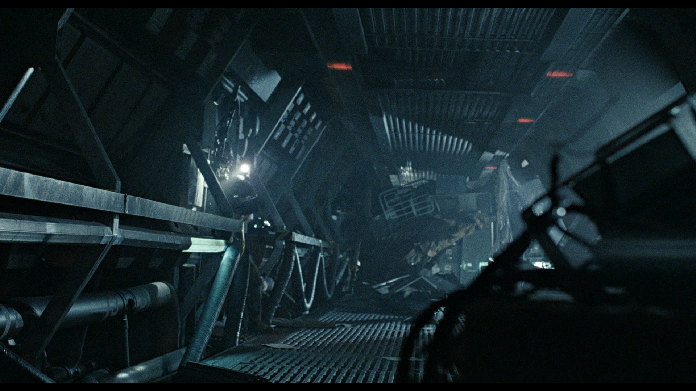
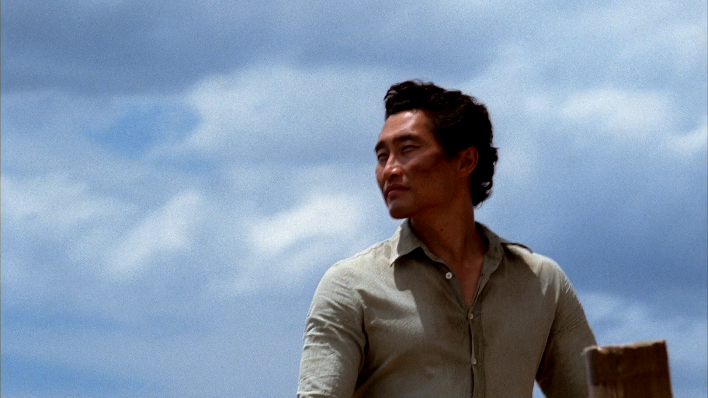
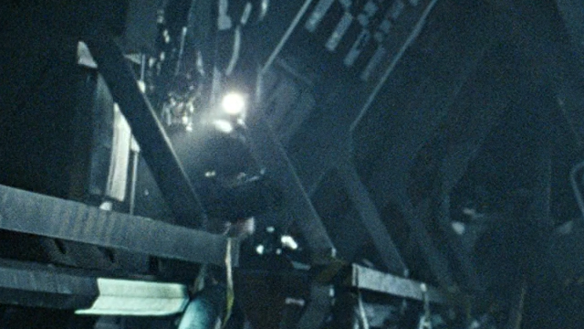
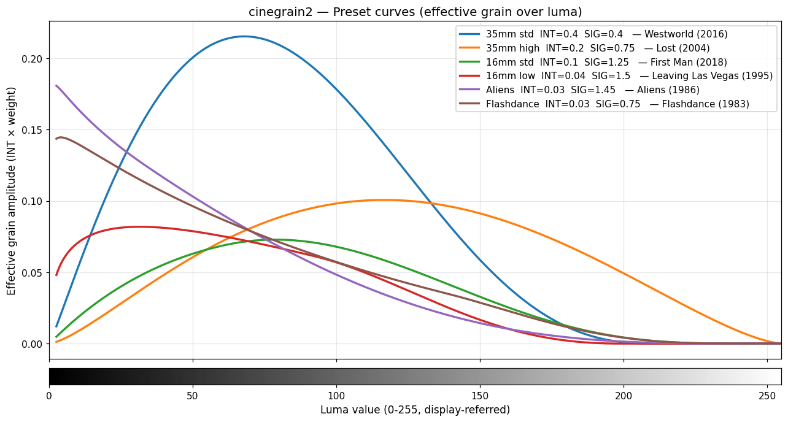
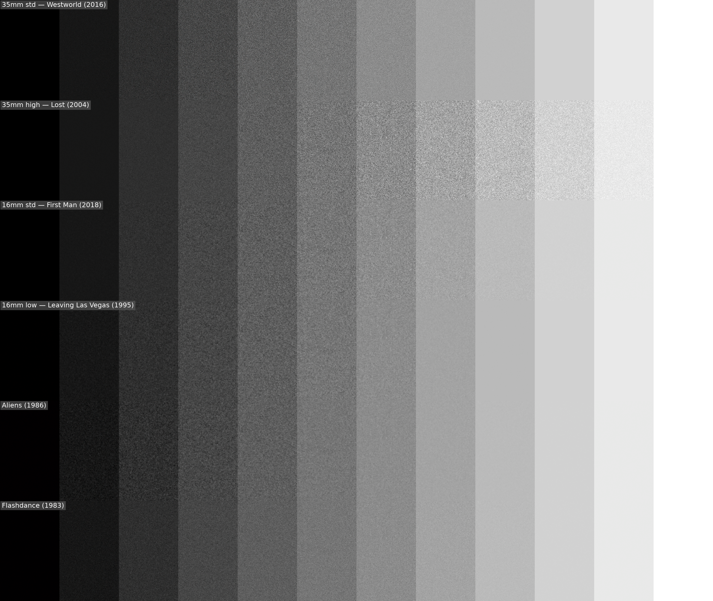
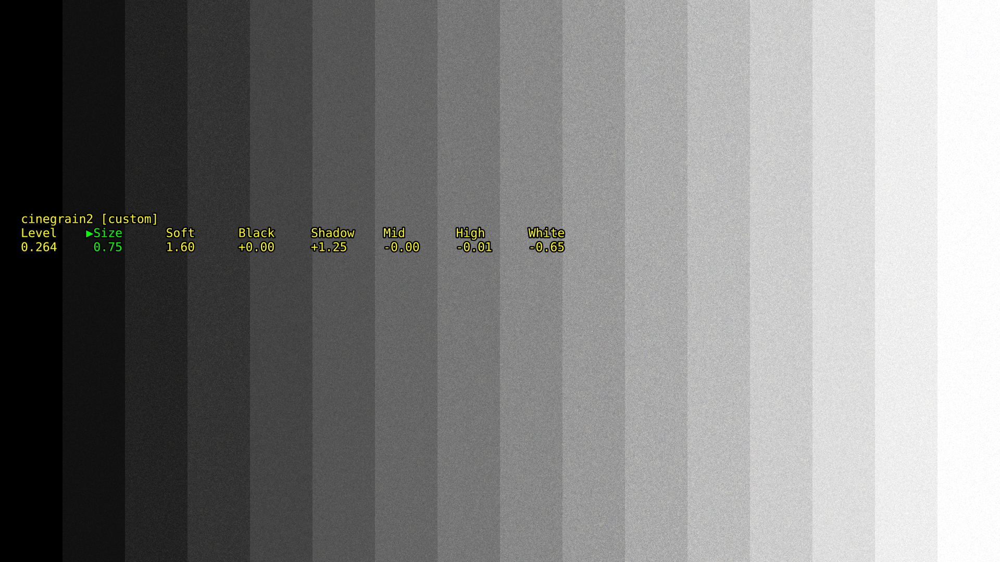
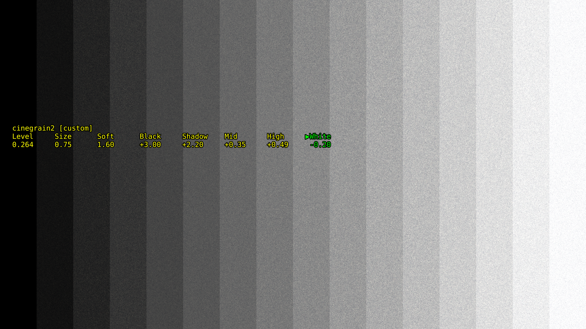
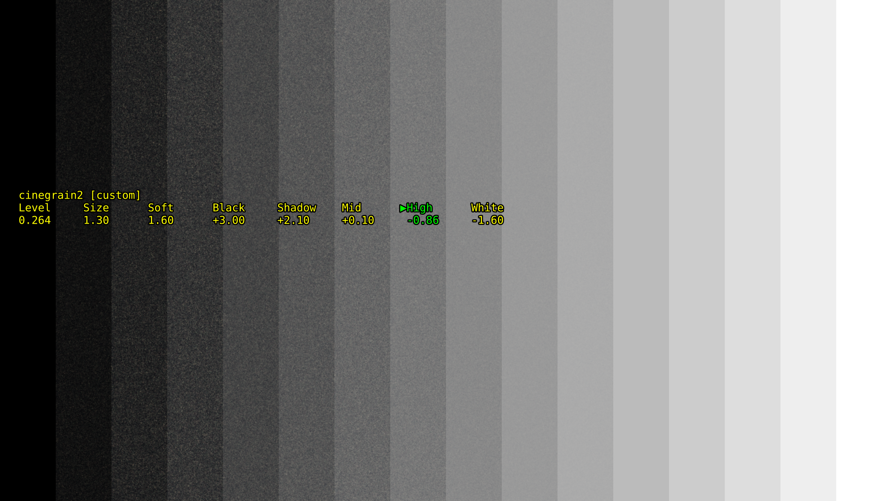

# cinegrain 2 - Let's make some more noise!

<p align="left"></p>

Realistic film grain for [mpv](https://mpv.io), with a five-zone equalizer that shapes the grain over the brightness range, the way real film stock does.

> **cinegrain 2 replaces [cinegrain](https://github.com/mr-berndt/cinegrain).** The original shader still works, but it is no longer developed.

---

## Why a second version

Watching films with the original cinegrain, I kept running into films whose grain looked very different from mine. The difference was easy to spot once I looked for it: **Aliens** is outright dirty in the lower brightness region and almost clean above mid brightness, while the TV show **Lost** has grain all the way up into the brightest parts of the picture and is rather clean at the bottom end.

| Aliens (1986): heavy grain in the shadows, clean highlights | Lost (2004): grain right up to the white sky |
|---|---|
| [](images/aliens-1986-original.png) | [](images/lost-s01e24-original.png) |
| [](images/aliens-1986-crop-bright.png) | [](images/lost-s01e24-crop-sky.png) |

*Top: full 1080p frames. Bottom: 1:1 crops, no scaling. Both without any synthetic grain. Click an image to see it at full size.*

Analyzing some more films showed what was going on: the intensity of real grain varies wildly along the brightness axis. The reasons are well known once you dig into it: different film stocks, and different ways of exposing and developing them. Here are the approximate grain curves of six films. They have little in common:

[](images/grain-curves-six-films.png)

Fun fact: Flashdance and Aliens match very closely!

The same six curves rendered as grain on a grey staircase, from black on the left to white on the right:

[](images/greystair-six-films.png)

A single bell curve with a peak and a width, which is what cinegrain 1 had, cannot follow shapes like these.

## The equalizer

So cinegrain 2 has a graphic equalizer with five zones:

| Zone | Brightness |
|---|---|
| Black | 0 % |
| Shadow | 13 % |
| Mid | 30 % |
| High | 60 % |
| White | 100 % |

Each zone raises or lowers the grain at its brightness, and the shader blends smoothly from one zone to the next. At 0 every zone gives the same amount of grain; −1 removes the grain in that zone completely, positive values add up to four times as much.

The equalizer sits as an overlay over the running picture and is operated with the arrow keys. A built-in grey staircase shows at any time how the grain behaves over the whole brightness range:

| Fine grain up into the highlights | Coarse grain over the whole range | Heavy in the shadows, clean on top |
|---|---|---|
| [](images/menu-greyramp-fine.png) | [](images/menu-greyramp-coarse.png) | [](images/menu-greyramp-shadows.png) |

## Restoring grain that encoding took away

Most Blu-rays and many other releases still show some of their original grain, but it has visibly suffered in the encode. With the equalizer and the on/off toggle, you set size and intensity per zone until the synthetic grain exactly matches what is left of the original, and fills in what was lost. That takes about 30 seconds and brings back the original look remarkably closely.

It also works wonders on DVDs. The grain acts as dither: the picture looks crisper, and compression artefacts are masked. DVDs become pretty watchable even on large screens and projectors.

## Simpler synthesis, predictable controls

With cinegrain 1 I could imitate most grain patterns by playing with the controls, but I could not simply make the grain larger or softer and keep its character. cinegrain 2 uses a simpler synthesis: white noise, shaped by a Gaussian blur for the grain size, with an optional softening on top. Size and softness now behave predictably, and the grain still looks real. While comparing, I more than once mixed up which grain was real and which was synthetic. Under a microscope there are certainly differences, but it beats every commercial solution I have come across.

---

## Installation

cinegrain 2 consists of one shader and one control script. Tested with mpv 0.40 and 0.41, with `vo=gpu-next` and `vo=gpu`.

1. Copy `shader/cinegrain2.glsl` to `~/.config/mpv/shaders/`.
2. Copy `scripts/cinegrain2-control.lua` to `~/.config/mpv/scripts/`.
3. Add the shader to `mpv.conf`, as the **last** shader in the chain:

   ```ini
   glsl-shaders-append="~~/shaders/cinegrain2.glsl"
   ```

On Windows the folder is `%APPDATA%\mpv\` instead of `~/.config/mpv/`.

The script finds the shader in the shader list by its file name, so the file may be renamed, as long as the name starts with `cinegrain2`. If the shader is missing, the overlay says so.

## Operation

| Keys | Action |
|---|---|
| `Alt+q` | grain on / off, to compare with the original |
| `Alt+←` / `Alt+→` | select the next control |
| `Alt+↑` / `Alt+↓` | change the selected control |
| `Alt+,` / `Alt+.` | previous / next preset |
| `Alt+d` | test picture: off → 50 % grey card → grey staircase |

The overlay shows all eight controls in one row, the selected one in green. It appears with the first key press and disappears 8 seconds after the last one.

### Controls

| Control | Range | Step | Meaning |
|---|---|---|---|
| Level | 0 … 5 | 0.01 | overall grain strength |
| Size | 0 … 3 | 0.05 | grain size (0 = single-pixel 35 mm grain, ~2.5 = 8 mm clumps) |
| Soft | 0 … 10 | 0.1 | softens the grain without changing its size |
| Black, Shadow, Mid, High, White | −3 … +3 | 0.05 | grain in that zone, relative to the others (−1 = none) |

Size is calibrated for 4K output and scales with the output resolution, so a setting looks the same at 1080p and 4K.

### Presets

`flat`, `35mm std`, `35mm high`, `16mm std`, `16mm low` and `Aliens`. A preset is a starting point: as soon as a control is touched, the overlay shows `[custom]`.

### Sidecars, per film and per series

When you change the grain while a local file is playing, the settings are stored next to the video when it closes, in a small text file:

- films: `<file name>.grain`, e.g. `Aliens (1986).grain`
- series (file names with `S01E02`): `<series>.grain` for the whole series, and optionally a handmade `<series> S01.grain` for one season, which takes precedence

The next time the film or an episode is played, its grain comes back by itself. Videos you only watch get no sidecar, and streams never do. Files without a sidecar start with the last settings used.

### Options

In `~/.config/mpv/script-opts/cinegrain2-control.conf`:

```ini
# store and load .grain sidecars next to the videos
sidecars=yes
# seconds the overlay stays after the last key press
osd_timeout=8
```

### Tips for matching

1. Pause on a calm shot with a wide range of brightness: sky, faces, dark corners.
2. Switch the grain off (`Alt+q`) and look at what is left of the original.
3. Switch it on, set **Size** first, then **Level**, then shape the zones: pull down the zones where the original is clean, raise those where it is heavy.
4. Toggle on and off until you cannot tell where the original ends.
5. Check the result on the grey staircase (`Alt+d` twice).

## License

MIT
